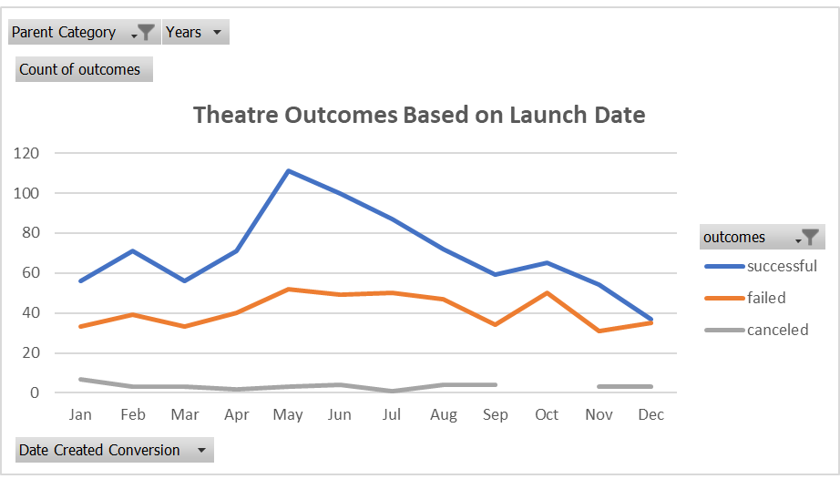
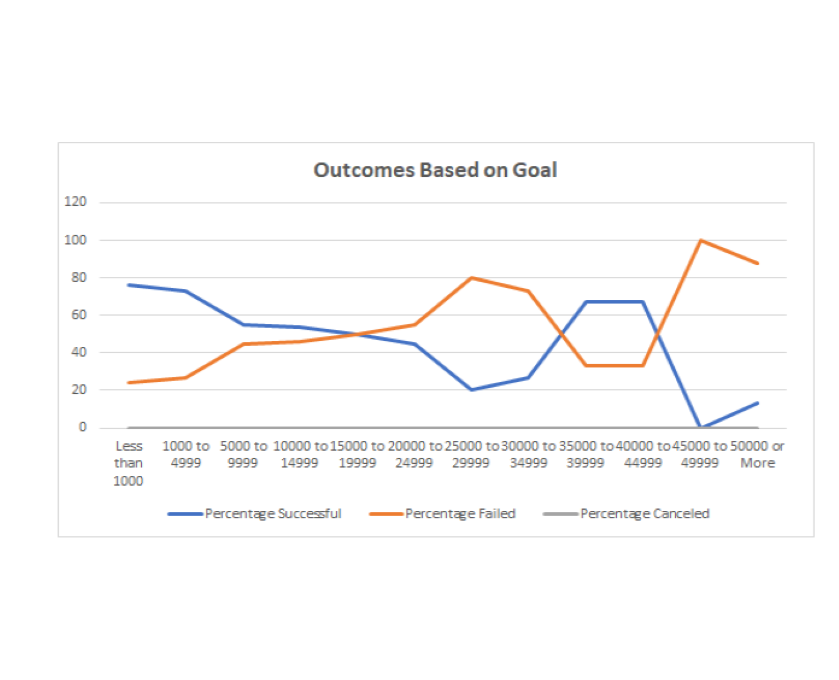

# Kickstarter-Analysis of Campaigns with the focus on Theatrical productions
## Overview and Purpose:
Louise intends on creating a play in the U.S.  For that reason, she wants to start a crowdfunding campaign.  Her main purpose is to understand how theatrical productions performed, in the past, based on "launch date" and "monetary goals."
## Purpose:
In an effort to help Louise understand the effectiveness and weaknesses of Theatrical production campaigns, the analysis of "outcomes" by "launch date" was performed first. Both Pivot table and chart illustrate the findings and analysis.
## Analysis of "Outcome" based on "Launch Date" 
In the Kickstarter dataset, "Outcome" variable indicates whether the campaign met it's goal by classifying it into "successful," failed" and "canceled" categories.
From the analysis, it is determined that the month of **May and June have the greatest "success" rate** of campaigns launched.  However, **January, March, November and December** have roughly similar number of failed campaigns launched. 

"Theater Outcomes Based on Launch Date" line chart is attached as a reference.

## Analysis of "Outcome" based on "Goals"
For the purpose of this analysis, "Goal" variable is divided into 12 dollar-amount categories, ranging from "Less than $1000" to "$5000 or More." 
The analysis of successful, failed and canceled outcomes based on funding goal amount for the "Plays" subcategory allows to determine that **the most successful "Plays" campaigns have Less than $5000 fundraising goal (76% for less than $1000 and 73% for $1000 to $4999)**
The percentage of failed "Plays" grows as the amount of funding goals increases.  In other words, a funding goal of $5000 and more generates negative response.

"Outcomes Based on Goals" line chart is attached as a reference.

## Challenges and Difficulties:
- Outcome based on Launch date - the overall analysis of the "Theater" category based on launch date provides no information about the theatrical genres, specifically "Plays."  Since, Louise's main focus is on Plays she will not fully benefit from the findings.
- Outcome based on Goal - Louis estimates that her play will cost $12,000 which is more than twice the average successful fundraising goal for "Plays."
## Concluding Results:
- May and June have the greatest success of launching a rewarding campain.
- Winter months, January, March, November and December are least likely to deliver expected campain goals.
- The most achievable funding goal for "Plays" is less than $5000.
## Overall limitations of the dataset:
- Limited number of variables in the dataset 
- Further dive in into additional factors that may influence the campaigns' outcomes is suggested, such as age, gender, income, education.
## Other possible tables:
- Mean and median 

[^1] Footnotes: Encountered challenges when running dataset/creating Readme file:
- resizing "Outcomes_vs_Goals" image
- no other challenges :smiley:

